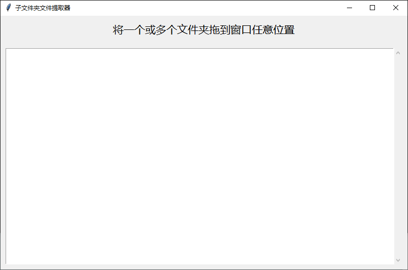

# 子文件夹文件提取器说明文档



## 一、工具简介

子文件夹文件提取器是一个基于 Python、Tkinter 和 tkinterdnd2 的桌面小工具。它用于将一个或多个文件夹内部的所有文件提取到这些文件夹的上一级目录中，并在移动完成后尝试删除原文件夹中的空目录。

该工具适合整理多层嵌套文件夹、解压后目录、下载目录、临时目录等场景，可以快速把分散在多个子文件夹中的文件统一移动到父目录下。

## 二、主要功能

1. 支持将一个或多个文件夹拖拽到程序窗口任意位置。
2. 自动递归扫描拖入文件夹中的所有子目录和文件。
3. 将扫描到的所有文件移动到拖入文件夹的父目录中。
4. 如果父目录中存在同名文件，自动生成不重复的新文件名，避免覆盖。
5. 文件移动完成后，自动尝试删除原文件夹内部的空目录。
6. 最后尝试删除拖入的原文件夹本身。
7. 如果原文件夹中仍有未能移动的文件或非空目录，则保留该文件夹。
8. 支持一次处理多个文件夹，并累计统计成功移动的文件数量。
9. 处理完成后弹出提示框，显示成功处理的文件总数。
10. 提供日志显示区域，实时显示处理过程。
11. 将处理日志同时追加写入到脚本所在目录下的 `提取日志.txt` 文件中。
12. 拖拽进入窗口时，窗口背景变为浅绿色，拖拽离开后恢复默认背景。

## 三、界面说明

程序窗口标题为：

```text
子文件夹文件提取器
```

窗口默认尺寸为：

```text
800 x 500
```

界面主要包含以下内容：

1. 提示标签  
   显示文字为：  
   `将一个或多个文件夹拖到窗口任意位置`  
   字体为微软雅黑，字号 16。

2. 日志显示框  
   使用 `ScrolledText` 创建，支持滚动查看日志内容。  
   处理过程中产生的日志会实时显示在该区域，并自动滚动到底部。

3. 拖拽区域  
   整个窗口注册为文件拖拽目标，因此可以将文件夹拖到窗口任意位置。

4. 拖拽视觉反馈  
   当拖拽内容进入窗口时，窗口背景变为浅绿色 `#d1ffd1`。  
   当拖拽内容离开窗口时，窗口背景恢复为默认背景色。

## 四、使用方式

1. 确保系统已安装 Python 3。
2. 确保已安装 `tkinterdnd2` 依赖库。
3. 运行程序后，打开工具窗口。
4. 将一个或多个文件夹拖拽到窗口任意位置。
5. 程序自动开始处理拖入的文件夹。
6. 处理过程中，日志区域会显示开始处理、目标目录、移动失败、完成统计等信息。
7. 处理完成后，会弹出提示框，显示成功处理的文件总数。

## 五、处理规则

### 1. 仅处理文件夹

拖入的内容如果是文件夹，则进行处理。  
拖入的内容如果是单个文件，则不会被处理。

### 2. 目标目录

每个被拖入文件夹的目标目录是其父目录。

例如：

```text
拖入文件夹：D:\下载\资料文件夹
目标目录：D:\下载
```

文件夹 `资料文件夹` 内部所有层级的文件都会被移动到 `D:\下载` 中。

### 3. 递归扫描

程序使用 `os.walk` 递归遍历拖入文件夹中的所有子目录。

遍历方式为自底向上：

```python
os.walk(folder, topdown=False)
```

这样可以先处理深层目录中的文件，再逐步清理空目录。

### 4. 同名文件处理

如果目标父目录中已经存在同名文件，程序不会覆盖原文件，而是自动生成新的文件名。

命名规则为：

```text
原文件名_1.扩展名
原文件名_2.扩展名
原文件名_3.扩展名
```

例如：

```text
目标目录中已存在：报告.docx
再次移动同名文件时生成：报告_1.docx
如果报告_1.docx 也存在：报告_2.docx
```

### 5. 文件移动

程序使用 `shutil.move` 移动文件。  
该方式可以在同一磁盘内移动，也可以跨磁盘移动。

### 6. 空目录清理

文件移动完成后，程序会再次自底向上遍历目录，尝试删除空文件夹。

删除顺序为：

1. 先删除最深层空目录。
2. 再删除上层空目录。
3. 最后尝试删除拖入的原文件夹本身。

如果目录不是空的，删除会失败，程序会忽略该错误并保留目录。

### 7. 多文件夹处理

如果一次拖入多个文件夹，程序会逐个处理。  
每个文件夹处理完成后都会记录日志。  
所有文件夹处理结束后，会累计成功移动的文件数量，并统一弹出完成提示。

## 六、日志功能

### 1. 日志文件位置

日志文件名为：

```text
提取日志.txt
```

日志文件位于脚本所在目录，即：

```python
os.path.join(os.path.dirname(__file__), "提取日志.txt")
```

### 2. 日志写入方式

日志以追加模式写入，编码为 UTF-8。  
每次写入都会带有时间戳。

时间戳格式为：

```text
[YYYY-MM-DD HH:MM:SS]
```

### 3. 日志显示

日志会同时输出到两个位置：

1. 程序窗口中的日志显示框。
2. 脚本目录下的 `提取日志.txt` 文件。

日志显示框会自动滚动到底部，方便查看最新处理进度。

### 4. 主要日志内容

程序会记录以下信息：

1. 开始处理某个文件夹。
2. 当前目标目录。
3. 文件移动失败信息。
4. 完成处理信息。
5. 成功移动的文件数量。
6. 分隔线。

示例：

```text
[2025-01-01 12:00:00] 开始处理: D:\下载\资料文件夹
[2025-01-01 12:00:00] 目标目录: D:\下载
[2025-01-01 12:00:01] 完成: 共移动 15 个文件
[2025-01-01 12:00:01] ============================================================
```

## 七、异常处理

1. 如果文件移动失败，程序会记录失败原因，并继续处理其他文件。
2. 如果删除空文件夹失败，程序会忽略错误，不会中断整体流程。
3. 如果原文件夹中仍有文件或非空子目录，原文件夹会保留。
4. 如果目标目录存在同名文件，程序会自动重命名，不会直接覆盖。
5. 如果拖入的内容不是文件夹，则跳过不处理。

## 八、函数职责说明

### 1. `write_log(text)`

负责写入日志。

功能包括：

1. 生成当前时间戳。
2. 将日志追加到日志显示框。
3. 自动滚动到日志框底部。
4. 刷新窗口界面。
5. 将日志追加写入 `提取日志.txt`。

### 2. `unique_name(dst_dir, filename)`

负责生成目标目录中的唯一文件名。

功能包括：

1. 检查目标目录中是否已存在同名文件。
2. 如果存在，则依次尝试 `文件名_1.扩展名`、`文件名_2.扩展名` 等。
3. 返回一个不会与现有文件冲突的新文件名。

### 3. `process_folder(folder)`

负责处理单个文件夹。

功能包括：

1. 获取文件夹绝对路径。
2. 获取父目录作为目标目录。
3. 递归遍历文件夹内所有文件。
4. 将文件移动到父目录。
5. 对同名文件自动重命名。
6. 统计成功移动的文件数量。
7. 记录移动失败日志。
8. 删除空目录。
9. 尝试删除原文件夹。
10. 写入完成日志和分隔线。
11. 返回成功移动的文件数量。

### 4. `on_drop(event)`

负责处理拖拽释放事件。

功能包括：

1. 获取拖入的路径列表。
2. 恢复窗口默认背景。
3. 遍历每个拖入路径。
4. 判断是否为文件夹。
5. 对文件夹调用 `process_folder`。
6. 累计成功移动的文件数量。
7. 弹出完成提示框。

### 5. `on_drag_enter(event)`

负责处理拖拽进入窗口事件。

功能包括：

1. 将窗口背景设置为浅绿色 `#d1ffd1`。

### 6. `on_drag_leave(event)`

负责处理拖拽离开窗口事件。

功能包括：

1. 将窗口背景恢复为默认背景色。

## 九、依赖与运行

### 1. 运行环境

需要 Python 3 环境。

### 2. 依赖库

程序使用以下模块：

1. `os`
2. `shutil`
3. `time`
4. `tkinter`
5. `tkinter.messagebox`
6. `tkinter.scrolledtext.ScrolledText`
7. `tkinterdnd2.DND_FILES`
8. `tkinterdnd2.TkinterDnD`

其中，`tkinterdnd2` 需要额外安装。

安装命令：

```bash
pip install tkinterdnd2
```

### 3. 运行方式

保存 Python 脚本后，直接运行即可。

例如：

```bash
python 文件名.py
```

## 十、适用场景

1. 整理多层文件夹中的文件。
2. 将解压后嵌套目录中的文件统一提取到上一级。
3. 整理下载目录、临时目录、素材目录。
4. 批量移动某个文件夹内部所有层级的文件。
5. 清理空文件夹。
6. 避免手动逐层剪切和粘贴文件。

## 十一、注意事项

1. 本工具会实际移动文件，使用前建议先备份重要数据。
2. 文件会被移动到拖入文件夹的父目录中，请确认目标位置符合预期。
3. 如果父目录中已有同名文件，程序会自动重命名，不会覆盖原文件。
4. 空目录会被删除，非空目录会保留。
5. 日志文件 `提取日志.txt` 会持续追加内容，长期使用后文件可能变大。
6. 不建议将系统盘根目录或重要系统目录拖入处理。
7. 处理大量文件时，由于操作在主线程中执行，界面可能会出现短暂无响应或刷新较慢。
8. 拖入多个文件夹时，程序会逐个处理，并在最后统一显示成功移动的文件总数。
